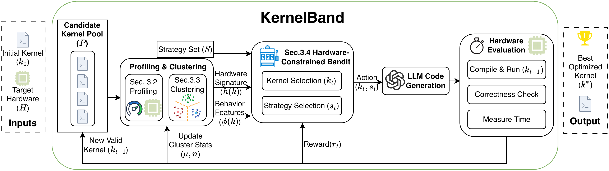
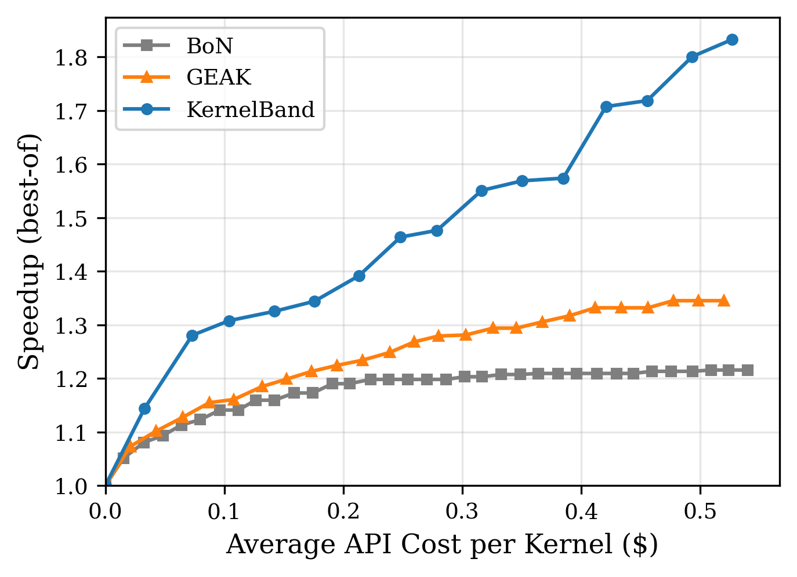

<p align="center">
  
</p>

<h1 align="center">KernelBand</h1>

<p align="center">
  <b>Steering LLM-based Kernel Optimization via Hardware-Aware Multi-Armed Bandits</b>
</p>

<p align="center">
  🎉 <b>Accepted at <a href="https://icml.cc/virtual/2026/poster/62803">ICML 2026</a></b> 🎉
</p>

<p align="center">
  <a href="https://icml.cc/virtual/2026/poster/62803"></a>
  <a href="https://arxiv.org/abs/2511.18868"></a>
</p>

<p align="center">
  <a href="#news">News</a> &bull;
  <a href="#key-results">Results</a> &bull;
  <a href="#quick-start">Quick Start</a> &bull;
  <a href="#acknowledgments">Acknowledgments</a> &bull;
  <a href="#citation">Citation</a>
</p>

---

KernelBand formulates GPU kernel optimization as a **Multi-Armed Bandit (MAB)** problem, explicitly balancing exploration and exploitation to unlock the potential of code LLMs. To navigate the infinite arm space of optimization strategies applied to candidate kernels, it introduces two key mechanisms: a **hardware-aware pruning strategy** via profiling bounds and a **trace-driven clustering algorithm** that leverages Lipschitz continuity. KernelBand achieves up to **1.91x geometric mean speedup** with **39-140% higher Fast@1** success rates over existing baselines.

## News

- **[2026/05]** Paper accepted to **ICML 2026**! See the [poster page](https://icml.cc/virtual/2026/poster/62803).
- **[2026/02]** Code released.
- **[2026/02]** Paper updated on [arXiv](https://arxiv.org/abs/2511.18868).
- **[2025/11]** Paper released on [arXiv](https://arxiv.org/abs/2511.18868).

## Key Results

### Main Results across 3 GPU Architectures (Table 1)

Geometric mean speedup (standard mode, computed over correct tasks only). Evaluated on 183 TritonBench-G kernels with T=20 iterations.

| Platform | Method | Correct (%) | Fast@1 (%) | Speedup |
|:---|:---|:---:|:---:|:---:|
| RTX 4090 | BoN | 31.1 | 10.0 | 0.96x |
| | GEAK | 55.6 | 31.1 | 1.44x |
| | **KernelBand** | **77.8** | **43.3** | **1.74x** |
| H20 | BoN | 29.3 | 15.9 | 0.99x |
| | GEAK | 49.4 | 23.8 | 1.06x |
| | **KernelBand** | **79.3** | **57.3** | **1.45x** |
| A100 | BoN | 31.2 | 16.8 | 0.98x |
| | GEAK | 48.0 | 38.7 | 1.34x |
| | **KernelBand** | **79.8** | **60.1** | **1.91x** |

> **33%+ average speedup improvement** over best baseline across 3 GPU architectures (Ada Lovelace, Hopper, Ampere).

### LLM Generalization (Table 2)

KernelBand consistently outperforms baselines regardless of the underlying LLM. Evaluated on a 50-kernel subset on H20.

| LLM Backend | Method | Correct (%) | Fast@1 (%) | Speedup |
|:---|:---|:---:|:---:|:---:|
| DeepSeek-V3.2 | BoN | 27.5 | 12.5 | 1.10x |
| | GEAK | 37.5 | 17.5 | 0.95x |
| | **KernelBand** | **85.0** | **67.5** | **1.52x** |
| GPT-5 | BoN | 44.9 | 28.6 | 1.14x |
| | GEAK | 51.0 | 24.5 | 1.07x |
| | **KernelBand** | **81.6** | **65.3** | **1.72x** |
| Claude Opus 4.5 | BoN | 40.8 | 24.5 | 1.17x |
| | GEAK | 63.3 | 38.8 | 1.30x |
| | **KernelBand** | **89.8** | **73.5** | **1.82x** |
| Gemini 3 Flash | BoN | 47.9 | 25.0 | 1.20x |
| | GEAK | 62.5 | 37.5 | 1.21x |
| | **KernelBand** | **70.8** | **45.8** | **1.48x** |

### API Cost Scaling

<p align="center">
  
</p>

## Quick Start

### 1. Environment Setup

```bash
conda create -n kernelband python=3.10 -y
conda activate kernelband
pip install -r requirements.txt
```

### 2. Generate Golden Baselines

Speedup calculation requires GPU-specific baseline measurements. Generate them for your GPU:

```bash
# Generate baselines (auto-detects GPU model)
python scripts/generate_golden_metrics.py

# Or for specific kernels only
python scripts/generate_golden_metrics.py --kernels vector_addition_custom add_value
```

### 3. Configure and Run

```bash
# Edit your config (see docs/usage.md for all parameters)
vim configs/examples/test_config.yaml

# Run optimization
python -m kernelband --config configs/examples/test_config.yaml
```

For detailed configuration options, MAB parameters, output format, and troubleshooting, see the **[Usage Guide](docs/usage.md)**.

For kernel selection utilities, see the **[Kernel Selection Guide](docs/list_kernels.md)**.

## Acknowledgments

KernelBand builds on two key upstream projects:

**TritonBench** — The benchmark dataset of 184 GPU kernels used for evaluation originates from [TritonBench](https://github.com/thunlp/TritonBench) by THUNLP. KernelBand uses the TritonBench-G subset (generation tasks) as its evaluation suite.

**GEAK** — KernelBand's agent framework builds upon [GEAK](https://github.com/AMD-AIG-AIMA/GEAK) by AMD-AIG-AIMA (Apache 2.0). GEAK's agent architecture and evaluation pipeline were reused and extended. GEAK-eval also provided corrected versions of several TritonBench kernels, which KernelBand further adapted for NVIDIA compatibility.

We gratefully acknowledge both teams for open-sourcing their work.

### Upstream Citations

```bibtex
@misc{li2025tritonbenchbenchmarkinglargelanguage,
      title={TritonBench: Benchmarking Large Language Model Capabilities for Generating Triton Operators}, 
      author={Jianling Li and Shangzhan Li and Zhenye Gao and Qi Shi and Yuxuan Li and Zefan Wang and Jiacheng Huang and Haojie Wang and Jianrong Wang and Xu Han and Zhiyuan Liu and Maosong Sun},
      year={2025},
      eprint={2502.14752},
      archivePrefix={arXiv},
      primaryClass={cs.CL},
      url={https://arxiv.org/abs/2502.14752}, 
}
```

```bibtex
@misc{wang2025geakintroducingtritonkernel,
      title={Geak: Introducing Triton Kernel AI Agent & Evaluation Benchmarks}, 
      author={Jianghui Wang and Vinay Joshi and Saptarshi Majumder and Xu Chao and Bin Ding and Ziqiong Liu and Pratik Prabhanjan Brahma and Dong Li and Zicheng Liu and Emad Barsoum},
      year={2025},
      eprint={2507.23194},
      archivePrefix={arXiv},
      primaryClass={cs.CL},
      url={https://arxiv.org/abs/2507.23194}, 
}
```

## Citation

If you find this work useful, please cite:

```bibtex
@inproceedings{ran2026kernelband,
      title={KernelBand: Steering LLM-based Kernel Optimization via Hardware-Aware Multi-Armed Bandits}, 
      author={Dezhi Ran and Shuxiao Xie and Mingfang Ji and Anmin Liu and Mengzhou Wu and Yuan Cao and Yuzhe Guo and Hao Yu and Linyi Li and Yitao Hu and Wei Yang and Tao Xie},
      booktitle={International Conference on Machine Learning (ICML)},
      year={2026},
      url={https://arxiv.org/abs/2511.18868}, 
}
```

## License

This project is licensed under the Apache License 2.0. See [LICENSE](LICENSE) for details.
